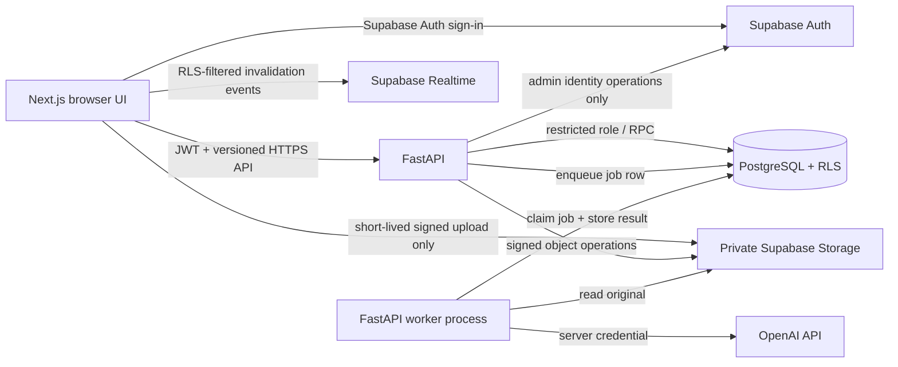

# Design

## Context

See `proposal.md` for motivation and the capability specs for normative behavior.

The repository is greenfield: at the time of this design it contains only a minimal README and an initialized, empty OpenSpec tree. There is no application code, schema, deployed environment, or existing data to migrate. The first useful workflow must serve a seven-person Belarusian company operating two salons and one workshop at roughly 20 orders per month, while keeping boundaries that can support substantially more staff, locations, and business modules.

This is a private single-company system, not a public SaaS or multi-tenant platform. Customer records, original form images, commercial values, and later employee/finance data are sensitive. The design therefore treats PostgreSQL as the business source of truth, private object storage as the source for original files, FastAPI as the trusted business-operation boundary, and AI as a fallible suggestion producer.

## Goals / Non-Goals

**Goals:**

- Establish a secure modular-monolith foundation with explicit domain and trust boundaries.
- Make the first order path small enough to deliver and verify end-to-end.
- Enforce authorization in both FastAPI and PostgreSQL RLS, with separate projections for sensitive fields.
- Keep originals immutable and AI output traceable, versioned, and subordinate to human confirmation.
- Keep database, API, job, and UI contracts evolvable through migrations and versioned schemas.
- Permit later CRM, warehouse, finance, payroll, analytics, and owner-AI modules without introducing microservices or generic multi-tenancy now.

**Non-Goals:**

- Implementing, scaffolding, provisioning, or deploying any application component in this change.
- Public registration, customer logins, public order tracking, or a SaaS tenant model.
- Finalizing the detailed AI extraction schema before representative anonymized forms are reviewed.
- Building salaries, expense accounting, inventory, warehouse operations, advanced analytics, or the owner AI assistant in the MVP.
- Selecting a permanent FastAPI hosting vendor, queue vendor, analytics platform, or document OCR subsystem now.
- Full chat, email, SMS, e-signature, online payment, or accounting integrations.
- Treating the audit log as event sourcing; current business tables remain the source of current state.

## Decisions

### 1. Use a modular monolith with managed platform services

**Decision:** Build one Next.js web application, one FastAPI codebase with a separately runnable worker process, and one Supabase project per environment. Organize FastAPI by domain modules and keep synchronous business transactions in one PostgreSQL database.

**Why:** The team and current volume do not justify distributed services. A modular monolith minimizes deployment and consistency costs while domain packages, API contracts, and database ownership boundaries preserve an extraction path if scale later requires it.

**Alternatives considered:**

1. **Recommended: FastAPI modular monolith + Supabase platform services.** Strong server-side control, Python-native AI integration, one transaction boundary, and manageable operations.
2. **Next.js/Supabase-only backend.** Fewer deployables, but business rules would spread across route handlers, database functions, and the browser; Python AI workflows would become awkward and privileged operations easier to misuse.
3. **Microservices and an event bus from day one.** Offers independent scaling but adds network failure modes, distributed authorization, duplicate schemas, and operational burden with no present-volume benefit.

Microservices, Kafka-class infrastructure, Kubernetes, CQRS, and a generic plugin system are explicitly deferred until measured constraints justify them.

### 2. Define clear runtime ownership



**Next.js owns:** responsive screens, authenticated navigation, draft editing UX, QR display, mobile capture UX, extraction review UX, and realtime-triggered refetch. It may use the public Supabase anon configuration for Auth and authorized Realtime only. It does not contain authoritative transition rules or privileged secrets.

**FastAPI owns:** authentication verification, coarse authorization, input/output validation, business commands, DTO projections by role, upload-session lifecycle, re-authorized sensitive-file streaming, idempotency, OpenAI orchestration, account administration, and audit-query endpoints. Its OpenAPI document is the API contract source for a generated TypeScript client.

**PostgreSQL/Supabase owns:** durable relational state, constraints, transactions, RLS, atomic command functions where needed, audit immutability, job leasing, Storage metadata and policies, and authorized Realtime change publication.

**Worker owns:** reliable asynchronous extraction attempts and later background tasks. It is a second process from the same FastAPI codebase, not a separate service or repository. At initial scale, a PostgreSQL job table claimed with bounded leases and `FOR UPDATE SKIP LOCKED` is sufficient; a managed queue is deferred.

**OpenAI owns:** model inference only. It never becomes the business source of truth and never receives browser-originated credentials.

### 3. Use a monorepo with domain-oriented service modules

Proposed structure (directories appear only when their phase starts):

```text
Planeta-AI/
├── apps/
│   └── web/                         # Next.js/React/TypeScript
│       ├── src/app/                 # authenticated, mobile-upload, error routes
│       ├── src/features/            # identity, orders, uploads, production, owner
│       ├── src/components/          # shared presentation components
│       ├── src/lib/                 # API client, auth adapter, realtime adapter
│       └── tests/
├── services/
│   └── api/                         # Python/FastAPI modular monolith
│       ├── app/api/v1/              # transport and DTO boundary
│       ├── app/core/                # config, auth verification, errors, telemetry
│       ├── app/domains/
│       │   ├── identity/
│       │   ├── orders/
│       │   ├── uploads/
│       │   ├── extraction/
│       │   ├── production/
│       │   └── audit/
│       ├── app/infrastructure/      # Supabase, PostgreSQL, Storage, OpenAI adapters
│       ├── app/jobs/                # job definitions and worker entrypoint
│       └── tests/                   # unit, API, and integration tests
├── packages/
│   └── api-client/                  # generated TypeScript client; not hand-edited
├── supabase/
│   ├── migrations/                  # schema, functions, grants, RLS, Storage policies
│   ├── tests/                       # database/RLS assertions
│   └── seed.sql                     # non-secret local/development reference data only
├── contracts/                       # generated/published OpenAPI snapshots and fixtures
├── docs/
│   ├── architecture/
│   ├── operations/
│   └── decisions/                   # concise ADRs for later material decisions
├── tools/                           # repository-local development/verification scripts
├── .github/workflows/               # CI after implementation is approved
└── openspec/                         # specifications and change history
```

There is no cross-language shared domain package. FastAPI types define transport contracts; the TypeScript client is generated from versioned OpenAPI. Business rules are implemented once in FastAPI and enforced with database constraints/functions where atomicity or security requires it.

### 4. Use a relational core with versioned JSON at the uncertain edges

PostgreSQL UUID primary keys remain the technical identifiers. Human identifiers are separate immutable unique values. Timestamps are stored as UTC `timestamptz` and displayed in `Europe/Minsk`. Money uses fixed precision plus ISO currency code; the initial product default is expected to be BYN, but the schema does not encode amounts as floating point.

The initial entity model is:

| Entity | Purpose and key relationships |
|---|---|
| `profiles` | 1:1 extension of `auth.users`; display name, active flag, locale, timestamps. Business records reference this stable ID, not email. |
| `roles` / `profile_roles` | Initial OWNER, SELLER, PRODUCTION permission bundles. Normalized assignment avoids replacing identity references if roles expand. |
| `salons` / `profile_salons` | Retail locations and workforce membership. Initial seller visibility is salon-scoped; owner is company-scoped. |
| `workshops` / `profile_workshops` | Production locations and membership. One row initially, but production jobs are not hard-coded to a singleton. |
| `order_number_counters` | Per-year counter locked transactionally to allocate non-reused `PS-YYYY-NNNN` values. |
| `orders` | Aggregate root: UUID, order number, salon/workshop, creator/assigned seller, lifecycle, deadline, schema/version number, current confirmed revision, timestamps. |
| `order_customer_details` | Current order-scoped customer/contact data separated from production and financial projections. May later reference `customers`. |
| `customers` | Optional canonical CRM identity introduced when the CRM phase begins; orders keep snapshots so history never depends on a mutable customer row. |
| `order_financials` | One-to-one restricted commercial fields such as currency, total, prepayment, and balance. Separate table simplifies least-privilege access. |
| `order_items` | Ordered child rows for each curtain/product. Stable queryable fields coexist with `details JSONB` and `details_schema_version` for form-specific attributes. |
| `order_revisions` | Immutable numbered confirmation/amendment snapshots with schema version, actor, reason, source extraction references, and fingerprint. |
| `order_files` | Immutable metadata for private Storage objects, checksum, media type, size, page/order association, uploader context, and lifecycle marker. |
| `upload_sessions` | Hashed QR secret, issuer, order, expiry, claim/consume/revoke times, failed-attempt counters, and claim binding. No plaintext bearer secret persists. |
| `extraction_jobs` | Durable leased job record with state, retry count, schedule, and idempotency key. |
| `extraction_attempts` | File, provider/model, prompt version, extraction schema version, status, timings, token/cost metadata, structured result JSON, and sanitized error. |
| `field_review_decisions` | Optional per-field acceptance/correction/rejection provenance linked to an extraction attempt and order draft/revision. |
| `production_jobs` | One per confirmed order for the initial workflow; workshop, current state, version, timestamps, and withdrawal marker if the order is cancelled. |
| `production_status_events` | Immutable transition history including actor, from/to state, reason, and time. |
| `idempotency_records` | Caller, operation, key, request fingerprint, outcome reference, and expiry for retry-sensitive API commands. |
| `audit_events` | Append-only security/business history with actor kind/id, action, target, order/salon linkage, safe before/after data, reason, correlation, source, and time. |

Key relationships:

```text
auth.users 1──1 profiles M──N roles
                        M──N salons
                        M──N workshops
salons 1──M orders M──1 workshops
orders 1──1 order_customer_details
orders 1──1 order_financials
orders 1──M order_items
orders 1──M order_revisions
orders 1──M order_files 1──M extraction_attempts
orders 1──M upload_sessions
orders 1──1 production_jobs 1──M production_status_events
orders 1──M audit_events
```

The hybrid shape is intentional: stable fields needed for validation, RLS, production lists, money, and analytics are relational; changing form-specific attributes and raw model results are versioned JSONB. The exact candidate extraction schema will be replaced or extended after anonymized real forms are evaluated. JSONB is not used as a substitute for core relational fields.

### 5. Separate commercial, extraction, and production state

One overloaded status would allow AI or production activity to change commercial authority accidentally. Use independent state machines:

**Commercial order:**

```text
DRAFT ──confirm──> CONFIRMED ──archive after completion──> ARCHIVED
  └────cancel────────> CANCELLED ──archive───────────────> ARCHIVED
CONFIRMED ──cancel with reason/coordination──> CANCELLED
CONFIRMED ──amend with reason──> CONFIRMED (new numbered revision)
```

- Draft edits use optimistic `version` checks.
- Confirmation validates required fields and atomically creates revision 1 and the single NEW production job.
- Amendments are explicit commands; they never overwrite an earlier confirmed snapshot.
- Cancellation retains files, revisions, and history and withdraws active production work without deleting it.
- Archival is a visibility/retention transition, not data deletion.

**Extraction attempt:** `QUEUED -> RUNNING -> SUCCEEDED | FAILED | CANCELLED`. A retry is a new attempt linked to the preceding attempt, not mutation of its evidence.

**Production:** normal `NEW -> IN_PROGRESS -> DONE`; OWNER-only corrective transitions may move backward with a required reason. A withdrawn/cancelled order is represented separately from the normal three-state production progression so reporting does not confuse cancellation with manufacturing completion.

Transitions are server commands with expected versions, database constraints, transition history, and atomic audit events. Realtime signals occur only after commit.

### 6. Authenticate with Supabase Auth and authorize through RBAC plus resource scope

- Disable public sign-up in Supabase. Do not ship a sign-up screen or call client-side `signUp`.
- Provision users through an OWNER-only FastAPI operation that validates the owner again, calls the Supabase Admin API, creates business profile/assignments, and audits the action.
- The browser obtains a Supabase access token. FastAPI verifies signature, issuer, audience, expiry, and key rotation through cached JWKS, then loads the active business profile on each protected request.
- Disabling a user sets `profiles.is_active = false`, revokes/blocks the Auth identity where supported, and is enforced by FastAPI and every RLS helper on each protected request so an old JWT is insufficient. Realtime carries generic invalidation only; it has no protected row or identity payload that an established subscription could leak after disable.
- Use unique named workforce accounts. Shared salon or workshop accounts are prohibited because they make audit attribution meaningless.
- Require current MFA assurance for every OWNER-authorized operation at FastAPI and hardened database-command boundaries. The initial bootstrap creates an attributed pending owner that gains effective OWNER authority only after MFA enrollment and verification; future stronger factors preserve `profiles.id` and business foreign keys.

- Enforce active-OWNER continuity through one transactionally checked trusted backend/database guard used by disable, deactivation, OWNER-role removal, and every supported role/membership mutation; UI controls are advisory only.

Initial authorization matrix:

| Resource/action | OWNER | SELLER | PRODUCTION |
|---|---|---|---|
| Users, roles, location assignments | Full administration | None | None |
| Draft/confirm order | All salons | Assigned salon(s) | None |
| Confirmed production view | Full | Assigned salon(s) | Assigned workshop, production projection only |
| Prices/prepayment | Full | Permitted orders | None |
| Original forms | All | Permitted orders | Confirmed assigned production orders |
| Production transition | Full/corrective | Read only | Forward transitions in assigned workshop |
| Company-wide audit/analytics | Full | No | No |

RLS policies derive permissions from `auth.uid()`, active profile state, role assignment, salon/workshop membership, order lifecycle, and resource linkage. Reusable SQL authorization helpers must be narrowly scoped, tested, and safe from recursive-policy behavior. Sensitive commercial columns live in separate tables with no PRODUCTION grants. Production uses a dedicated view/API projection rather than relying on clients to hide columns.

For normal user requests, FastAPI uses a database/PostgREST path that preserves the user's claims so RLS remains active. The Supabase service-role credential is reserved for operations that inherently require Auth administration and is encapsulated in the identity infrastructure adapter; it is never the default business-data client. Background jobs use a dedicated constrained database role or hardened command functions, not browser credentials.

### 7. Store original forms privately and immutably

- Use a private `order-originals` bucket. Never create a public bucket or permanent public URL.
- Use non-guessable paths without customer names or order numbers, for example `orders/{order_uuid}/{file_uuid}/original`.
- Keep original bytes unchanged. Image normalization, thumbnails, previews, or OCR-friendly renditions go into a separate private derived-object namespace and reference the original.
- Record size, detected media type, original client filename as untrusted metadata, checksum, creation time, uploader/session, and optional supersedes relationship in `order_files`.
- Disallow overwrite-in-place. A better scan is a new row and object; earlier originals remain available according to retention policy.
- FastAPI authorizes every workforce original-file access request and streams it through an authenticated gateway that re-checks active profile state; it does not issue bearer download URLs for sensitive originals. Realtime payloads never contain file URLs.
- Start with a configured allowlist covering actual mobile formats selected after device testing. MIME sniffing and size/dimension limits are server-validated; the client-provided content type is not trusted.
- Storage lifecycle and database retention must be coordinated so a database restore does not point to missing objects. The backup plan must cover both association metadata and object recovery/versioning.

### 8. Use a claim-then-upload QR protocol

The preferred flow is:

1. The signed-in desktop user creates a draft and requests `POST /v1/orders/{id}/upload-sessions`.
2. FastAPI verifies order edit permission and DRAFT state, generates at least 256 bits of randomness, stores only a keyed or salted hash, sets a default expiry no greater than 15 minutes, and returns a QR URL.
3. Put the secret in the URL fragment (`https://app.planetashtor.com/mobile-upload#token=...`) so it is not sent in the initial HTTP request, reverse-proxy log, or Referer header. The page removes the fragment from browser history immediately.
4. The page posts the token in the request body to the claim endpoint. The server atomically verifies expiry/state/hash, marks the QR token claimed, and issues a different short-lived scoped claim credential. The page reveals no customer or order details before a successful claim.
5. The claimed session requests a server-selected object key and short-lived signed upload instruction. It cannot supply another order ID or arbitrary path.
6. The browser uploads directly to private Storage. FastAPI then finalizes: verifies session binding, object presence, size/type/checksum, creates the immutable `order_files` row, consumes the session, audits the event, and enqueues extraction atomically where possible.
7. The desktop UI learns of the new file by authorized polling or Realtime invalidation and refetches the order.

The QR bearer token is single-claim; the derived claim permits bounded retries on the same device flow until success or expiry. This avoids making a weak camera-scanned URL reusable while tolerating mobile network failure. Prefer same-origin routing under `app.planetashtor.com/api/...` so the derived credential can be an HttpOnly, Secure, narrowly scoped cookie. If deployment topology prevents that, use a short-lived opaque claim token held only in memory, with strict CORS and no local-storage persistence.

Additional controls: one active session limit per draft/user as appropriate, explicit revoke/regenerate, constant-time hash comparison, rate limits by token fingerprint/IP/session, generic errors, Content Security Policy, no third-party analytics on the upload page, and security-event logging without plaintext tokens.

### 9. Keep AI extraction replaceable and schema-versioned

Finalization creates an idempotent database job. A worker claims the job with a lease, obtains time-limited access to the original, calls the configured server-side OpenAI model, validates structured output, and records an immutable extraction attempt. The initial preferred model may be configured as GPT-5.6 Sol, but model identity is environment configuration recorded per attempt rather than embedded in browser code or domain state.

The first extraction envelope has stable metadata and a deliberately adaptable payload:

```text
attempt metadata
document metadata / pages
customer candidate
order-level candidates (deadline, notes, commercial values)
items[] candidates
  stable candidate fields
  attributes{} for form-specific fields
  provenance[] / uncertainty
unmapped_fields[]
warnings[]
```

This is a transport for suggestions, not the authoritative order schema. Candidate values, raw provider output needed for diagnostics, prompt/schema version, and review decisions remain linked. The UI maps suggestions into the editable draft; the confirm command creates the authoritative revision. Provider failures leave a fully usable manual form.

Before the detailed schema is approved, collect a small anonymized evaluation set representing different handwriting, layouts, item counts, corrections, and image quality. Version expected fields and tolerances, evaluate field-level coverage and dangerous-error classes, and only then promote stable fields into relational columns or required confirmation rules.

### 10. Use explicit transactional audit events, not blanket data dumping

Important command handlers write a curated `audit_events` row in the same database transaction as the business change. Hardened database functions or narrowly targeted triggers cover invariants that could otherwise bypass auditing, such as role/status changes. Generic triggers that dump every full row are rejected because they leak sensitive data, create noise, and cannot capture business intent or reason.

Each event includes: immutable ID, UTC time, actor kind and ID, issuer where relevant, role/scope snapshot, action code, entity type/ID, optional order/salon linkage, request/correlation ID, source channel, reason, safe before/after or changed-field representation, and metadata schema version. Token values, credentials, files, and unnecessary personal data are never included.

Application roles can insert audit data only through approved command paths and can never update/delete it. OWNER gets searchable access; sellers and production may receive a limited record activity feed only for permitted records. Database-owner access remains an operational privilege and is monitored separately.

### 11. Expose versioned command-oriented APIs

All business endpoints live under `/v1`. Resource reads use role-specific DTOs; state changes use explicit commands rather than generic table CRUD. Representative contracts:

| Area | Endpoint shape | Notes |
|---|---|---|
| Session | `GET /v1/me` | Active profile, roles, locations, UI capabilities. |
| Users | `GET/POST /v1/users`, `PATCH /v1/users/{id}` | OWNER only; invite/create, roles/scopes, disable. |
| Orders | `POST /v1/orders`, `GET /v1/orders`, `GET /v1/orders/{id}` | Scoped list/detail; UUID or human number lookup without enumeration leakage. |
| Draft | `PATCH /v1/orders/{id}/draft` | Requires expected version; updates aggregate fields/items transactionally. |
| Confirmation | `POST /v1/orders/{id}/confirm` | Idempotency key + expected version; creates revision and production job. |
| Amendment/cancel | `POST /v1/orders/{id}/amendments`, `POST /v1/orders/{id}/cancel` | Explicit reason and concurrency control. |
| Upload issue | `POST /v1/orders/{id}/upload-sessions` | Authenticated desktop caller; returns QR content and expiry. |
| Mobile upload | `POST /v1/mobile-upload-sessions/claim`, `.../upload-intent`, `.../finalize` | Scoped token protocol; no workforce JWT required after valid claim. |
| Files | `GET /v1/orders/{id}/files`, `POST /v1/files/{id}/access` | Metadata and re-authorized authenticated streaming access. |
| Extraction | `GET /v1/orders/{id}/extractions`, `POST /v1/extractions/{id}/retry`, `POST /v1/extractions/{id}/review` | Suggestions, retry, review provenance. |
| Production | `GET /v1/production-orders`, `GET /v1/production-orders/{id}`, `POST /v1/production-orders/{id}/transitions` | Sanitized projection and versioned transitions. |
| Audit | `GET /v1/audit-events` | OWNER search/filter; pagination and safe payloads. |

Errors use a stable envelope such as `{code, message, field_errors, correlation_id}`. Use `401` for missing/invalid authentication, `403` for known-but-disallowed actions, `404` where existence must not be disclosed, `409` for version/idempotency/state conflicts, `422` for validation, and `429` for abuse controls. Never encode authorization solely in frontend capability flags.

### 12. Treat Realtime as notification, not authority

Publish only the minimum rows/views needed for order and production invalidation, with RLS enabled. Clients respond to an event by refetching an authorized API representation. This prevents stale event payloads, column leakage, and business-rule duplication. Polling remains a safe fallback; a Realtime outage must not block order confirmation or status reads.

Background jobs use leased rows with attempt limits, exponential backoff, dead-letter status, and observable age. At current volume there is no reason to provision a dedicated queue, but the job interface keeps that replacement possible.

### 13. Make Supabase SQL migrations the only schema authority

Use ordered SQL migrations under `supabase/migrations` for tables, constraints, indexes, functions, grants, RLS, Realtime publication, and Storage policies. Do not introduce Alembic in parallel; two migration authorities create drift. FastAPI persistence models adapt to the migrated schema and CI verifies a clean database can be built from zero.

Migration rules:

- Review SQL and policy changes like application code.
- Prefer expand/backfill/switch/contract for deployed schema changes.
- Make destructive changes separate, backed up, measured, and explicitly approved.
- Seed only non-secret local/development reference data automatically. Production users and credentials are provisioned through controlled operations.
- Test forward migration from the last supported schema and clean bootstrap.
- Prefer forward fixes in production. A rollback may revert application deployment only when the database change remains backward compatible.
- Verify RLS and grants after every migration; a successful DDL command is not sufficient.

Because this repository has no production schema or data, the first implementation is a bootstrap, not a legacy migration. Import of any existing spreadsheets or historical orders is a later, separately specified change.

### 14. Test by trust boundary and business invariant

**Domain unit tests:** order/production state matrices, permission decisions, identifier formatting, money calculations, draft validation, extraction-to-draft mapping, token hashing/expiry, and audit payload redaction.

**Database integration tests:** clean migration bootstrap; constraints; yearly counter concurrency; all RLS policies tested as OWNER, multiple salons' SELLERs, PRODUCTION, disabled, anonymous, worker, and upload-session contexts; audit atomicity/immutability; idempotency; job leasing; no sensitive fields in production projections.

**API integration/contract tests:** JWT verification and rotation behavior, OWNER MFA assurance, role/scope denial, active-user revocation for API/file/Realtime paths, stable errors, optimistic conflicts, idempotent commands, upload claim races, authenticated file-gateway scope, extraction retries, and OpenAPI-to-TypeScript generation drift.

**Storage/security tests:** MIME spoofing, oversize files, arbitrary key attempts, replayed/expired/revoked tokens, concurrent claims, unauthorized authenticated file-gateway requests, overwrite attempts, and log/token leakage checks.

**End-to-end tests:** owner invites a user; seller signs in, creates a draft, uses a simulated mobile flow, reviews manual/AI suggestions, confirms; production receives the order and progresses it; owner inspects audit history. Realtime tests assert eventual UI convergence and polling fallback, not dependence on event payload authority.

**AI evaluation:** anonymized real-form fixtures, versioned expected fields, separate metrics for extraction coverage and dangerous false certainty, multi-item preservation, and human-review usability. Live-provider tests are opt-in, budgeted, and never run in ordinary unit CI.

**Operations tests:** environment-secret checks, migration rehearsal, backup/restore drill, and representative order-file integrity verification before production becomes authoritative.

### 15. Isolate development and production from the beginning

Use separate Supabase projects, Storage buckets, Auth users, OpenAI credentials/limits, FastAPI deployments, Vercel projects, and secret sets for development and production. Local development may later use the Supabase local stack, but Phase 1 must not require production credentials.

Recommended configuration layers are validated environment variables with committed `.env.example` files containing names only. Browser-exposed variables are limited to public URLs/anon keys intended for client use. Server secrets exist only in FastAPI/worker/deployment secret stores. CI receives least-privilege test credentials.

The future public shape is `app.planetashtor.com` for the web application, preferably with same-origin `/api` routing to FastAPI. The internal API host, Vercel use, FastAPI provider, CDN/WAF, and regional placement remain deploy-time ADRs after data residency, budget, backup tier, and operational ownership are confirmed.

Production readiness requires HTTPS, strict CORS/host allowlists, CSP and secure headers, error monitoring with PII controls, database and Storage recovery documentation, access-key rotation procedures, dependency/security scanning, and a tested break-glass owner recovery procedure.

### 16. Deliver vertical slices without prebuilding future modules

The phase sequence in `tasks.md` keeps the user's requested five-stage shape but splits Phases 1-3 into independently verifiable increments. CRM, employee records, analytics, salaries, finance, inventory, and the owner AI remain separate future OpenSpec changes. Only extension seams—stable identities, salon/workshop ownership, order revisions, safe audit/query interfaces—are created now.

Features and decisions explicitly deferred:

- Detailed extraction fields, prompts, thresholds, and model fallback policy until real anonymized forms are assessed.
- Customer master-data matching/deduplication and CRM workflows.
- Employee HR records beyond authentication/profile/scope; salaries and payroll.
- Expense ledger, accounting, payment processing, profitability, and broad finance access.
- Warehouse/inventory entities, reservations, procurement, and stock movements.
- Full internal messaging/chat, attachments, read receipts, notifications, email/SMS, and escalation rules.
- Advanced dashboards, salon benchmarking, scheduled reports, and Excel export details.
- Owner AI retrieval/actions, vector search, embeddings, tool permissions, and AI write operations.
- PWA install/offline sync, native mobile apps, barcode flows, and public customer portals.
- Multi-company tenancy, plugin frameworks, microservices, dedicated message brokers, data warehouses, and Kubernetes.
- Permanent hosting vendor choices and production plan purchases.

## Risks / Trade-offs

- **[Supabase service-role key is inherently broad]** → Restrict it to server-side Auth administration, encapsulate its use, alert on use, rotate it, and never use it as the routine data client.
- **[RLS can be correct in one path and bypassed in another]** → Default-deny grants, role-matrix integration tests, user-claim-preserving data access, hardened DB functions, and security review for every policy migration.
- **[Production field projection may omit something the workshop genuinely needs]** → Start from a named allowlist, test with workshop staff, and add fields deliberately rather than exposing the seller DTO.
- **[QR bearer token can be photographed or shared]** → Very short expiry, URL fragment, single atomic claim, no pre-claim PII, revoke/regenerate, derived device-bound capability, generic errors, and rate limiting.
- **[Direct-to-Storage upload can leave orphan objects]** → Predetermined temporary keys, finalization checks, short lifecycle cleanup for unfinalized objects, and no business association until transactionally finalized.
- **[AI misreads handwriting or expresses false certainty]** → Human confirmation gate, uncertainty/provenance display, manual path, real-form evaluation, immutable attempts, and no automatic production admission.
- **[Flexible JSON becomes an unqueryable dumping ground]** → Restrict JSONB to evolving attributes/results, version every shape, promote stable/reportable fields through migrations, and validate at API boundaries.
- **[Annual human-number allocation creates contention]** → One tiny locked counter row per year; at expected and foreseeable volume this is negligible and easy to test.
- **[PostgreSQL job queue competes with database workload]** → Use indexes, short leases, bounded polling/backoff and metrics; replace behind the job interface only if measured load justifies it.
- **[Realtime creates a false impression of consistency]** → Use events only as invalidation signals and refetch authoritative projections; preserve manual refresh/poll fallback.
- **[Backups may restore rows but not matching objects]** → Treat database and Storage recovery as one runbook, enable appropriate object durability/versioning, record checksums, and rehearse restoration.
- **[Later finance/HR requirements could pressure current order tables]** → Keep restricted financial/contact tables and module boundaries, preserve confirmed snapshots, and add ledgers/modules through new specs rather than expanding role access casually.
- **[Two deployable runtimes add operational work]** → Keep one repository, one API codebase, generated contracts, simple worker deployment, and avoid additional services until justified.

## Migration Plan

This is a greenfield bootstrap. No current application or production data is replaced.

1. Review and approve this OpenSpec change; resolve the Phase 1 approval questions below.
2. Implement Phase 1 in development only: repository skeleton, isolated configuration, Supabase schema/RLS foundation, Auth integration, owner bootstrap, and automated security tests.
3. Recreate a clean development database entirely from migrations and verify the full RLS matrix before adding order data.
4. Implement Phases 2 and 3 as vertical slices behind development configuration; test representative mobile devices and anonymized forms.
5. Provision production as a separate environment only after threat review, recovery plan, restore rehearsal, and go-live checklist.
6. Apply the same reviewed migrations to production with a pre-deploy backup and post-deploy policy checks; create the initial owner through the documented bootstrap procedure.
7. Roll back application releases only when database compatibility permits. For data/schema faults, stop writes if necessary, preserve evidence, restore only through the rehearsed process, and prefer reviewed forward-fix migrations.

## Open Questions

### Confirmed GrillMe decisions

The completed GrillMe review supersedes conflicting defaults above. SELLER scope is all orders in explicitly assigned salons; the director has OWNER+SELLER unioned rights in one interface; other workforce profiles do not combine SELLER and PRODUCTION. OWNER MFA, immediate disabled-account enforcement, and preservation of at least one active OWNER are mandatory.

MVP includes minimal canonical customers (display name, one normalized phone, optional Instagram), item-level fabric/sewing price and discount values, labelled OTHER charges, immutable PAYMENT/REFUND/REVERSAL history, derived balances, and explicit overpayment visibility. Customer merge, persistent multiple contacts, ledger/accounting, and payment-error reporting mechanics remain deferred.

Confirmed orders require customer name and phone, an active item, due date, valid commercial totals, and a current document set except for an attributed OWNER no-original exception. Production uses one job per order and shared workshop queue. SELLER/OWNER amend while NEW; later production-relevant changes are OWNER-only and require PRODUCTION acknowledgement before DONE. Cancellation/rework acknowledgement preserves history; cancelled orders are copied to new drafts rather than reinstated.

QR sessions are single-active, multi-file document-set sessions. DRAFT technical rescans delete discarded unconfirmed bytes and extraction results with minimal audit evidence; confirmed-revision originals remain immutable. AI batch acceptance is review-screen-only and excludes warned candidates.

Structured financial data is excluded from production DTOs, API, RLS, and Realtime. Originals may physically contain financial content; whether PRODUCTION receives originals, redacted derivatives, or a constrained alternative after form review remains deferred.

Production infrastructure is company-controlled. Database/Storage are private-by-default; secrets are server-side; no production PII or secrets enter repository, seeds, client bundles, public buckets, or routine logs. Core database, storage, and backups are EU; only necessary form content is sent server-side to AI. Production requires approved security/privacy review and recovery drill.

### Must be confirmed before Phase 1 implementation

The prior GrillMe interview resolved the identity and RLS decisions. The following operational inputs remain protected deployment inputs rather than OpenSpec business decisions:

1. **Initial OWNER bootstrap email:** provide `OWNER_BOOTSTRAP_EMAIL` only through secure deployment input when bootstrap is actually executed.
2. **Production provider terms:** validate selected EU storage/backup and AI provider terms before real data and production authorization.
3. **Production provisioning identities:** create real salons, workshop, and staff only through controlled OWNER provisioning; development seeds stay neutral.

### Intentionally deferred until the relevant phase

- Representative anonymized order forms, required confirmation fields, handwriting conventions, supported languages, item taxonomy, and acceptable extraction quality thresholds (before Phase 2 AI schema work).
- Required mobile formats and maximum file/page sizes after testing the actual phones/tablets used in salons (before Phase 2 upload limits are fixed).
- Detailed production-field rules and acknowledgement UI after real anonymized form review; the approved authority rule is SELLER/OWNER while NEW and OWNER-only after IN_PROGRESS.
- Whether Phase 3 needs a minimal append-only order comment thread or messaging remains a separate later module; this foundation does not implement chat.
- Legal/business retention periods for customer data, originals, audit events, cancelled orders, and employee records (before production retention automation).
- FastAPI hosting provider, monitoring vendor, production Supabase/backup tier, exact RPO/RTO, and same-origin routing implementation (before production deployment).
- Whether any future historical-data migration becomes necessary; MVP starts new orders without importing manual registers, using calendar-year `Europe/Minsk` numbering.
